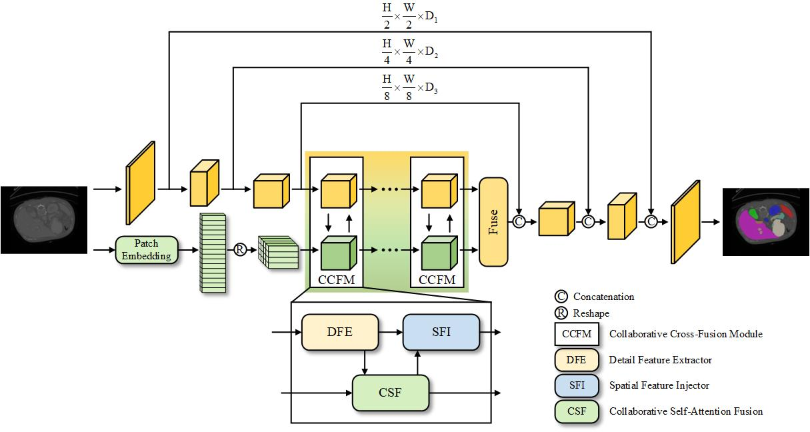

# PFNet
This repo holds the code of PFNet: A Parallel Fusion Network of CNN and Transformer for Medical Image Segmentation

## Environment
- Please prepare an environment with python=3.7, and then use the command "pip install -r requirements.txt" for the dependencies.

## Model Overview

      

## Prepare data
- The datasets we used are provided by TransUnet's authors. [Get processed data in this link] (https://drive.google.com/drive/folders/1ACJEoTp-uqfFJ73qS3eUObQh52nGuzCd). Please go to ["./datasets/README.md"](datasets/README.md) for details, or please send an Email to jienengchen01 AT gmail.com to request the preprocessed data. If you would like to use the preprocessed data, please use it for research purposes and do not redistribute it (following the TransUnet's License).

## Train/Test
- Run the train script on synapse dataset. The batch size we used is 24. If you do not have enough GPU memory, the bacth size can be reduced to 12 or 6 to save memory.

- Train and Test
CUDA_VISIBLE_DEVICES=0 python train.py --dataset Synapse

## References
* [TransUnet](https://github.com/Beckschen/TransUNet)
* [Swin-Unet](https://github.com/HuCaoFighting/Swin-Unet)
